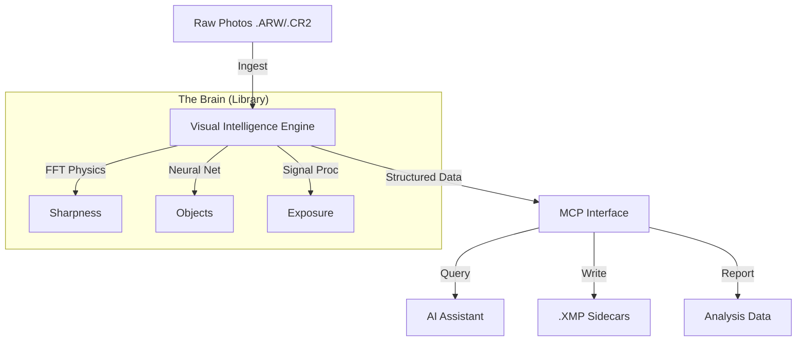

# photographi: Local Computer Vision Engine

[](https://opensource.org/licenses/MIT)
[](https://modelcontextprotocol.io)
[](https://www.python.org/downloads/)

**Give your computer "eyes" to understand your photo library.**

`photographi` is a local-first **Visual Intelligence Engine** that transforms a folder of raw images into a queryable, semantic database. Instead of just seeing files, it sees *content*—analyzing sharpness, exposure, subjects, and composition using professional-grade signal processing and neural networks.

It runs 100% locally on your machine, ensuring privacy while unlocking powerful workflows like **Semantic Search**, **Automated Auditing**, and **Smart Culling**.

---

## 👁️ What It Sees

The engine combines physics and AI to extract deep insights from every pixel:

*   **Deep Signal Analysis**: Uses FFT (Fast Fourier Transform) to measure optical sharpness independent of content.
*   **Neural Recognition**: Leverages **YOLO12x** to identify people, animals, and objects, allowing for context-aware scoring (e.g., "Sharp eyes are critical for portraits").
*   **Zone System Exposure**: Analyzes luminance zones to detect non-recoverable clipping vs. artistic shadows.
*   **Noise Profiling**: Profiles sensor grain to distinguish between high-ISO texture and actual detail.

---

## ⚡ Applications

`photographi` is an engine. Culling is just *one* thing you can do with it.

### 1. 🔍 Semantic Search (via MCP)
Connect to an AI agent (Claude/Gemini) to ask questions about your library:
> *"Find me the sharpest photo of a dog running in the 'Park' folder."*
> *"Show me all underexposed portraits that I can save."*

### 2. 📊 Library Auditing
Understand your photography habits with data:
> *"Which lens gives me the highest sharpness score on average?"*
> *"What is my keeper rate for ISO > 3200?"*

### 3. 🧹 Smart Culling Workflow
Automate the tedious parts of your workflow:
> *"Mark all blurry photos as 'Rejected' in Lightroom sidecars."*

---

## 🏗️ Architecture



---

## 📦 Installation

```bash
# Install directly from source
git clone https://github.com/yourusername/photographi.git
cd photographi
pip install -e .
```

*Prerequisites: Python 3.10+, `pip`, and a folder of photos to analyze.*

---

## 🛠️ Usage

### Analyze & Audit
Get a deep technical report on a folder of images.

```bash
python server.py --analyze /path/to/photos
```

### Rank & Search
Find the absolute best technical image in a set.

```bash
python server.py --rank /path/to/photos --top 5
```

### Generate Culling Data
Create Lightroom-compatible XMP sidecars to visualize the engine's judgement.

```bash
python server.py --cull /path/to/photos --threshold 0.4 --mode xmp
```

---

## 📊 Performance Benchmark

| Capability | Speed (M1 Max) | Description |
| :--- | :--- | :--- |
| **Technical Scan** | **0.05s** / img | Pure signal processing (Sharpness/Exposure) |
| **Deep Vision** | **1.70s** / img | Full Neural Analysis (YOLO12x Subject Detection) |
| **Throughput** | **2,000+** img/hr | Capable of processing massive shoots overnight |

*Tested on 1TB External SSD with 24MP Sony ARW files.*

---

**License**: MIT
