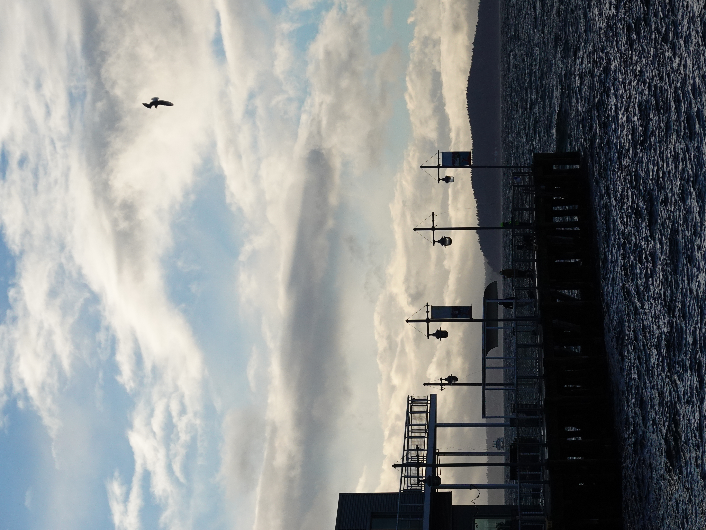
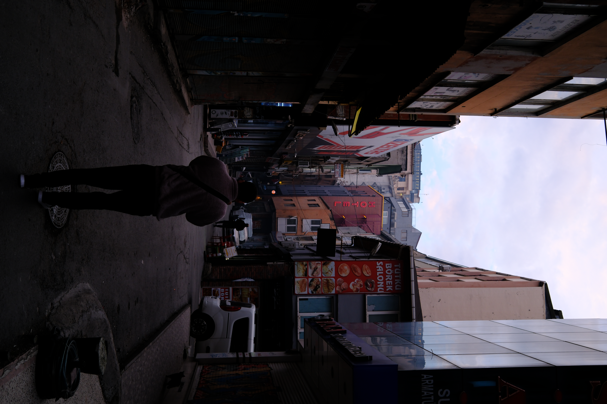

# photographi-mcp
**Fast, private, and grounded technical photo analysis for AI applications.**

`photographi-mcp` is an MCP server that enables AI models and LLM-powered tools to perform technical analysis on local photo libraries. It runs computer vision models directly on your hardware to evaluate sharpness, focus, and exposure—enabling capabilities like automated culling, burst ranking, and metadata indexing without requiring a cloud upload.

### ⚡ Why photographi?
- **Technical First**: Purpose-built for objective metrics (sharpness, lighting, focus). It provides technical data for evaluating image quality.
- **Token Efficient**: Save model context by pre-filtering technical metadata locally. Only the most relevant insights are sent to the AI application, keeping sessions fast and lean.
- **Privacy First**: All analysis happens 100% locally on your machine.
- **Low Latency**: Built for efficient processing, allowing for rapid ranking and technical feedback on local photo folders.
---

## 👁️ What It Analyzes

- **Smart Focus**: Detects subjects and verifies they're sharp
- **Exposure**: Catches blown highlights and blocked shadows  
- **Gear-Aware**: Knows your lens's sweet spot for optimal sharpness
- **Composition**: Evaluates framing and subject placement
- **Quality Alerts**: Flags motion blur, diffraction, high ISO noise

> [!NOTE]
> **Technical vs. Artistic**: This tool is strictly **objective**. It evaluates photos based on technical metrics and computer vision (sharpness, exposure, noise, etc.). It does **not** understand artistic intent, aesthetics, or "vibe." A blurry, underexposed photo may be an artistic masterpiece, but `photographi` will correctly flag it as technically poor.

For the science and math behind it, see the **[Technical Documentation](https://github.com/prasadabhishek/photo-quality-analyzer/blob/mainline/docs/SCIENCE.md)**.

---

## 📸 See It In Action

Here are real examples from actual photo analysis:

### Example 1: Excellent Photo


```json
{
  "overallConfidence": 0.89,
  "judgement": "Excellent",
  "keyMetrics": {
    "sharpness": 0.94,
    "exposure": 0.87,
    "composition": 0.85
  }
}
```
**Verdict:** Tack sharp on subject, well exposed, strong composition.

---

### Example 2: Poor Photo  


```json
{
  "overallConfidence": 0.20,
  "judgement": "Very Poor",
  "keyMetrics": {
    "sharpness": 0.30,
    "focus": 0.07,
    "exposure": 0.0
  }
}
```
**Verdict:** Missed focus on subject, severe underexposure/black clipping, and excessive headroom.

---

## 🛠️ Tools (MCP)

`photographi-mcp` exposes several tools for your AI:
- **`photographi_analyze_photo`**: Deep technical audit of a single image.
- **`photographi_analyze_folder`**: Statistical quality report for a folder.
- **`photographi_rank_photographs`**: Ranks photos by technical perfection (ideal for bursts).
- **`photographi_cull_photographs`**: Moves low-quality photos to a `culled_photos` folder.
- **`photographi_threshold_cull`**: Strict "Keep/Toss" sorting based on score.
- **`photographi_get_color_palette`**: Extracts dominant color palettes from an image.
- **`photographi_get_folder_palettes`**: Batch color extraction for an entire folder.
- **`photographi_get_scene_content`**: Identifies key objects (people, animals, etc.).

**[Full API Reference](docs/api-reference.md)**

---

## 🚀 Get Started

### Claude CLI (Fastest)
```bash
claude mcp add --scope user photographi uvx photographi-mcp
```

### Claude Desktop (macOS)
Add to `~/Library/Application Support/Claude/claude_desktop_config.json`:
```json
{
  "mcpServers": {
    "photographi": {
      "command": "uvx",
      "args": ["photographi-mcp"]
    }
  }
}
```

### GitHub Copilot CLI
Add to `~/.config/github-copilot/config.json`:
```json
{
  "mcp_servers": {
    "photographi": {
      "command": "uvx",
      "args": ["photographi-mcp"]
    }
  }
}
```

---

## 🔒 Privacy & Telemetry

`photographi` is built on a **Privacy-First** philosophy.
- **Anonymized Aggregates Only**: We never collect filenames, paths, or EXIF data.
- **Total Transparency**: Audit our collection logic directly in `analytics.py`.
- **Opt-Out**: Set the environment variable `PHOTOGRAPHI_TELEMETRY_DISABLED=1` or use the `--disable-telemetry` flag.

---

## 📖 Documentation

- **[Setup & Config Guide](docs/setup.md)**: Detailed configuration and troubleshooting.
- **[The Science](https://github.com/prasadabhishek/photo-quality-analyzer/blob/mainline/docs/SCIENCE.md)**: Math and theory behind the quality scoring.
- **[Contributing](CONTRIBUTING.md)**: How to help improve the project.
- **[GitHub Issues](https://github.com/prasadabhishek/photographi-mcp/issues)**: Report bugs or request features.

---

<div align="center">
  <p>
    <a href="https://opensource.org/licenses/MIT"></a>
    <a href="https://modelcontextprotocol.io"></a>
    <a href="https://www.python.org/downloads/"></a>
  </p>
  <p>Built with ❤️ for photographers</p>
</div>
