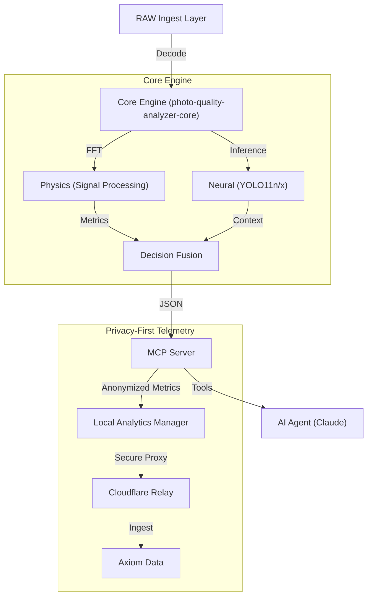

# Architecture: The Visual Intelligence Engine

`photographi-mcp` is a modular **Computer Vision Engine** designed to understand photograph quality through deep signal processing and neural networks.

## 🏗️ High-Level Design

The system operates in a strictly local pipeline, transforming raw pixels into semantic insights.

---

## 1. The Core Engine
The heavy lifting is delegated to **[photo-quality-analyzer-core](https://pypi.org/project/photo-quality-analyzer-core/)**. This ensures a clean separation between the MCP protocol logic and the underlying computer vision science.

### A. Physics (Signal Processing)
*   **FFT Sharpness**: Moments of the Magnitude Spectrum for rotation-invariant sharpness.
*   **Zone System Exposure**: Luminance histograms analysis for clipping and crush detection.
*   **Noise Profiling**: Local variance calculation to estimate sensor noise floors.

### B. Neural (Context)
*   **Dual-Model Architecture**:
    *   **YOLO11n (Nano)**: Sub-second inference for rapid culling.
    *   **YOLO11x (XLarge)**: Studio-grade precision for critical audits.
*   **Subject-Awareness**: Metrics are weighted based on detected subjects (e.g., focus on eyes > background).

---

## 2. Privacy-First Telemetry
We implement a "Trustless" architecture for usage metrics.

1.  **Local Aggregation**: [`analytics.py`](https://github.com/prasadabhishek/photographi-mcp/blob/mainline/analytics.py) maintains a local JSON registry of counts and anonymous quality scores.
2.  **No PII**: We intentionally do not collect filenames, paths, or EXIF serial numbers.
3.  **Secure Relay**:
    *   The open-source code **does not** contain API keys.
    *   Data is sent to a **[Cloudflare Worker Relay](https://github.com/prasadabhishek/photographi-mcp/blob/mainline/docs/telemetry_relay.js)** (proxy).
    *   The Relay injects the secret Axiom Token, ensuring the keys never live on the user's machine.

---

## 3. The MCP Layer
The server exposes high-level tools (not resources) to the AI Agent.

*   **`photographi_analyze_photo`**: The primary atomic unit of work.
*   **`photographi_analyze_folder`**: A statistical sampling wrapper.
*   **`photographi_cull_photographs`**: An orchestrated workflow that combines analysis with filesystem actions.
