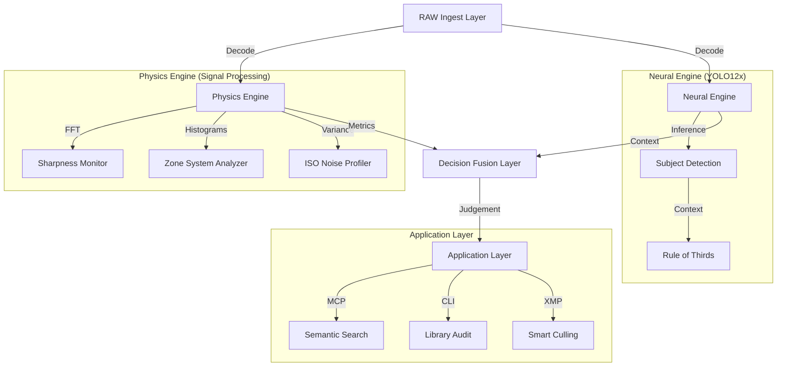

# Architecture: The Visual Intelligence Engine

`photographi` is not a script; it is a modular **Computer Vision Engine** designed to understand photograph quality through deep signal processing and neural networks.

## 🏗️ High-Level Design

The system operates in a strictly local pipeline, transforming raw pixels into semantic insights.

---

## 1. The Physics Engine (Signal Processing)
This layer deals with the "objective reality" of the image using mathematical transforms.

*   **FFT Sharpness**: We use the *Moments of the Magnitude Spectrum* in the frequency domain. This is robust against image noise and rotation, unlike simple Laplacian variance.
*   **Zone System Exposure**: Inspired by Ansel Adams, we analyze luminance histograms to detect *clipping* in critical zones (0 and 10) rather than just "brightness."
*   **Noise Profiling**: We calculate local variance in smooth patches to estimate the sensor's noise floor, distinguishing between "grainy" and "detailed."

## 2. The Neural Engine (Context)
This layer understands "what" is in the image to provide context to the physics.

*   **Subject Detection**: We run **YOLO12x** locally to identify People, Animals, and Cars.
*   **Contextual Weighting**: If a person is detected, the Sharpness score is weighted heavily on the *face/eyes*. If it's a landscape, the score is averaged across the frame.
*   **Composition**: Usage of the Rule of Thirds is calculated based on the bounding box centroids of detected subjects.

## 3. The Decision Fusion Layer
Raw numbers (e.g., "Sharpness: 0.04") are meaningless to a human. This layer maps metrics to judgements.

*   **Thresholds**: Dynamic thresholds based on EXIF data (e.g., we forgive motion blur if `Shutter Speed < 1/30` as "Artistic Intent").
*   **Confidence**: A composite score (0.0 - 1.0) representing the engine's certainty that a photo is technically technically sound.

## 4. The Application Layer (MCP)
The engine exposes its understanding via the **Model Context Protocol (MCP)**, allowing AI agents to query the library:

*   **ReadResource**: `photographi://analyze/path/to/folder` returns a JSON report.
*   **CallTool**: `analyze_photo` allows an agent to request processing on demand.
